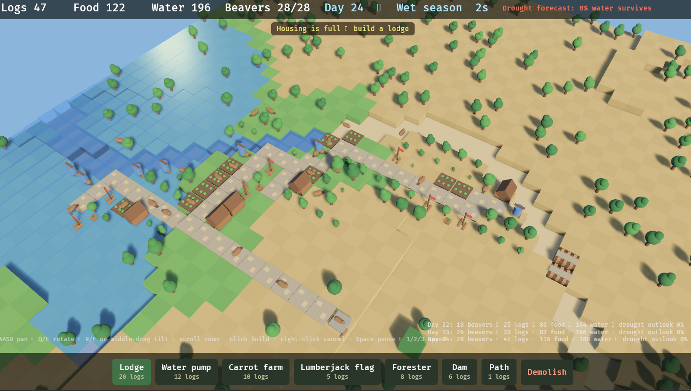
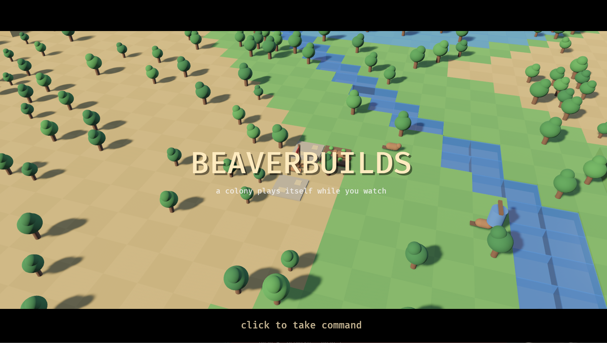

# BeaverBuilds

> [!IMPORTANT]
> **This entire project — code, tests, benchmarks, and prose — was written by an AI**
> (Anthropic's Claude), directed and reviewed by a human. It is **not affiliated with the
> Bevy Organization**, and it deliberately **takes no side in the debate around AI
> contributions to open source**. Per [Bevy's AI policy](https://bevy.org/learn/contribute/policies/ai/),
> AI-generated code cannot be merged into Bevy Org repositories — accordingly, **nothing
> here is submitted or intended for merging**. Read it as one possible shape of Bevy's
> reactive-BSN future: a working prototype with tests and measurements, offered as
> evidence for that design conversation — ideas that humans are welcome to evaluate,
> re-derive, and hand-author if they prove useful.

A small Timberborn-inspired beaver city builder, built on **Bevy 0.19** (the first
version that ships the new BSN scene system) plus a custom **reactive layer on top
of BSN**, since upstream BSN deliberately ships without reactivity.




## The game

You manage a beaver colony on a 48×48 tile map crossed by a river. The river runs during the
wet season and **stops during droughts** — water in the world evaporates, dry land turns
yellow, farms stop producing. **Droughts escalate**: every cycle survived makes the next
drought longer and the wet season shorter. Build dams to hoard water, keep food and
drinking water stocked, and grow the colony.

- **Lodge** — houses 5 beavers; new beavers are born while stocks last (each birth costs
  3 food and 3 water).
- **Water pump** — a beaver pumps drinking water from an adjacent water tile.
- **Carrot farm** — produces food, but only on irrigated (green) land.
- **Lumberjack flag** — beavers chop mature trees nearby for logs.
- **Forester** — plants new trees nearby.
- **Dam** — built in the river bed; holds water back so it survives the drought.
- **Path** — cheap stone paths; beavers walk much faster on them.

The world is rendered with distance fog and a two-light setup; droughts pull in a dusty
haze, harden the sunlight and dry out the grass — all of it reactive state. A long-lived
async "scribe" task writes a daily colony chronicle (bottom right) by bridging into the
world at a post-reactive sync point — a working miniature of the composition story
between Bevy's in-flight `bevy_async` bridge (PR #21744) and the reactive layer.

Beavers are simple agents: they claim the nearest posted job (construction first),
**pathfind to it on the async task pool** (A* that routes around water and trees and
bends along your stone paths), work, and the result lands in the colony stockpile. They eat and drink on a timer;
when stocks run out they turn red and eventually die. Lose the last beaver and the
colony falls — game over; click (or Space/Enter) to start a fresh colony.

**Controls:** WASD pan · Q/E rotate · scroll zoom · click a build button then a tile ·
right-click/Esc cancel · click a building to inspect · Space pause · 1/2/3 game speed.

## Running it

```sh
cargo run                 # opens on the cinematic intro; click to start playing
cargo run --release       # full optimization
```



The game opens as a **letterboxed cinematic intro**: a scripted governor plays a colony
at speed — bootstrapping lumberjacks, **damming the river as soon as the first lumberjack
provides income**, placing pumps on the pool side of the wall, planting foresters to keep
the wood supply alive, housing the population only behind a finished dam, paving roads
tile-by-tile — while the camera glides between points of interest. If the demo colony
ever falls, the intro restarts it on a fresh map. **Click (or Space/Enter) to take
command**: the demo world is torn down and a fresh colony starts on a brand-new map.

Optional environment variables (combinable):

| variable | effect |
|---|---|
| `BB_SKIP_INTRO=1` | boot straight into the game (no intro) |
| `BB_INTRO_SECS=n` | auto-start the game after n seconds of intro (CI/agent runs) |
| `BB_FAST=1` | start at 4× game speed |
| `BB_AUTOBUILD=1` | instantly place one of each building at startup (test rig) |
| `BB_SHOT=/path/prefix` | numbered screenshot every 10 s and on F12 |
| `BB_BENCH=1` | run the headless reactive-layer benchmarks and exit |
| `RUST_LOG=reactive_bsn=debug` | trace which dependency woke which reactor |

## Reactive BSN — the interesting part

The layer lives in [`crates/bevy_reactive_bsn`](crates/bevy_reactive_bsn) as a standalone,
tested, dual-licensed (MIT OR Apache-2.0, like Bevy) library with its own
[README](crates/bevy_reactive_bsn/README.md) and a
[design report](crates/bevy_reactive_bsn/PROPOSAL.md).

Bevy 0.19's BSN gives you `bsn!` scenes, field-level component **patches**, and
`apply_scene` to (re)apply a scene to an existing entity — but no reactivity: nothing
re-applies a scene when game state changes. Cart's stated direction (bevy discussion
[#14437](https://github.com/bevyengine/bevy/discussions/14437)) is "fine grained
observer-style reactivity" built on the ECS itself rather than a separate signal runtime.
The crate implements that:

```rust
// Reactive fragments compose directly inside bsn! trees — no special syntax,
// BSN parses them as ordinary scene-function includes (like `button("Ok")`):
bsn! {
    Node Children [
        reactive([Dep::resource::<Stockpile>()], |world: &World, _: Entity| {
            let s = world.resource::<Stockpile>();
            bsn! { Text({ format!("Logs {:.0}", s.logs) }) }
        }),
    ]
}

// ...or attach imperatively to existing entities:
commands.entity(light).insert(Reactor::patch(
    [Dep::resource::<Season>()],
    |world, _| {
        let drought = world.resource::<Season>().drought;
        bsn! { DirectionalLight { color: {sun_color(drought)}, illuminance: {lux(drought)} } }
    },
));
```

Design decisions, distilled from prior art (bevy_reactor/quill, bevy_cobweb, jonmo/haalka,
kayak, belly) and what died on which hill:

- **No shadow runtime, no signal cells.** Reactive state is ordinary ECS state. Dirtiness
  comes from Bevy's native change ticks — anything any system writes, with no wrapper
  (`React<T>`-style wrappers were bevy_cobweb's mistake), can drive a reactor.
- **Composable inside `bsn!`.** `reactive(..)`, `reactive_rebuild(..)` and
  `reactive_list(..)` return `impl Scene` (via BSN's template machinery), so reactive
  fragments are declared inline in scene trees; every spawn forks a fresh reactor
  instance. The whole HUD is five plain scene functions. Specs are shared and forkable:
  one `ReactorSpec` serves all 2300 grass tiles — and one entity can carry any number of
  independent fragments (`Reactor::and`, or sequential scene applications, which merge).
- **Declared dependencies** instead of implicit read-tracking — debuggable, no
  hook-ordering footguns, maps 1:1 onto change detection: `Dep::resource::<R>()`,
  `Dep::this::<T>()` (the reactor's own entity — what inline fragments use),
  `Dep::entity::<T>(e)`, `Dep::ancestor::<T>()` (the nearest `ChildOf` ancestor carrying
  `T` — a React-Context analog, read back with `world.nearest_ancestor::<T>()`),
  `Dep::presence::<T>(e)`/`presence_this`/`resource_presence` (insert/remove only —
  pair a structural rebuild on presence with a value patch, as the construction sites
  do), `Dep::resource_value(|r| …)`/`this_value`/`entity_value`/`parent_value` (tick-gated
  value *projections* — per-field wake granularity: the calendar re-renders once per
  displayed second while the countdown field ticks every frame, and a fat state component
  can be watched one field at a time), `Dep::components::<T>()`, and relationship-aware deps
  `Dep::related::<Children>(e)` / `Dep::related_components::<Children, T>(e)`
  ("react when T changes on anything related to e").
- **Amortized scheduling.** Whole-world deps (`Dep::components`) are answered by one
  shared scan per component type per frame, however many reactors watch that type;
  single-entity deps are O(1) tick compares. Stored ticks are clamped against
  `MAX_CHANGE_AGE`, so multi-day sessions can't wrap into false positives. Wake-ups are
  traced (`RUST_LOG=reactive_bsn=debug` shows *which dependency* woke each reactor).
- **Incremental updates via BSN patches.** A dirty reactor re-runs its scene function and
  `apply_scene`s the result onto its own entity: component patches merge in place, so
  hover/focus/animation state survives. No virtual-DOM diffing against live entities
  (the hill kayak_ui died on).
- **Ownership via the entity graph.** A reactor is a component; despawning the entity tears
  everything down. No subscription leaks.
- **Dynamic children are explicit**, because BSN's `apply_scene` re-spawns `Children [..]`
  lists on every application:
  - `reactive` / `Reactor::patch` — childless fragments, merged in place;
  - `reactive_rebuild` / `Reactor::rebuild` — replaces its subtree (the building info panel);
  - `reactive_list` / `ReactorList` — keyed collections (the colony warnings feed).
    The list reconciles **membership and order only**: vanished keys despawn, new keys
    spawn, survivors are left untouched — item content updates itself via embedded
    `reactive(..)` fragments. Derived state (like `StarvingCount`) lives in ordinary
    resources maintained at transitions, keeping dataflow queryable.
- **In-schedule, convergent execution.** Reactors run in one exclusive system in `Update`
  (after the fixed-tick simulation, before layout), looping until no reactor is dirty, with
  a pass cap + warning on divergence — same call quill's reaction control system made.

### Reactivity beyond the UI

The same primitive drives the game world, wherever state→visual mapping makes sense:

| What | Reactor | Wakes on |
|---|---|---|
| Water blocks (per tile) | scale/visibility from depth | per-tile `TileState` change |
| Grass tint | irrigated ↔ dry material | per-tile irrigation flips |
| Trees | scale from growth | that tree's `Tree` change |
| Buildings | gray + rising while building | `UnderConstruction` insert/change/remove |
| Beavers | red tint while starving | `Starving` marker insert/remove |
| Sunlight | warm/harsh during drought | `Season` resource |
| Ghost preview | position/validity color | `Tool`/`Hover`/`Stockpile`/`Map` |
| All HUD elements | texts, button states, panels | their declared resources |

The water *simulation* itself (a cellular automaton) and beaver *movement* stay plain
systems — continuous per-frame work is what the ECS hot path is for; reactivity is for
state→derived-state propagation. The sim mirrors per-tile values into `TileState`
components **only on meaningful change**, so per-tile reactors stay quiet for untouched
tiles instead of "the whole map changed every tick".

## Tests

`cargo test --workspace` — the reactive crate carries 40 behavioral tests; the game's
simulation has its own suite (pathfinding routes around walls and prefers stone paths,
the water step conserves mass, **dams must improve drought retention** — a gameplay
invariant that once failed and exposed a real balance bug — placement rules, droughts
escalate, births cost food and water, colony collapse triggers game over, the intro
governor survives several days headless while still building, and a deterministic
headless end-to-end run: place a lumberjack, advance ~56 simulated seconds, require
construction, pathfinding, chopping and logs to all have happened).

## Benchmarks

`BB_BENCH=1 cargo run --release` runs headless micro-benchmarks against a hand-written
`Changed<T>` system baseline. On a Ryzen 7 5800X (release, Bevy 0.19):

| scenario | ms/frame | per unit |
|---|---|---|
| 10k patch reactors (`Dep::this`), all idle | 0.42 | 42 ns/reactor |
| 10k patch reactors, 100 dirty/frame | 0.50 | ~0.8 µs/update |
| 10k patch reactors, all dirty every frame | 3.2 | ~280 ns/apply |
| 1k `Dep::components` watchers over 10k entities, idle | 0.11 | one shared scan |
| 10k value-projection deps, noisy resource, stable value | 0.48 | ≈ idle floor |
| baseline: plain `Changed<T>` system (10k, idle / all dirty) | 0.06 / 0.07 | ~6 ns/entity |

Reading: idle dirty-checks cost ~42 ns/reactor (≈7× the raw ECS floor — the price of the
dynamic layer); a BSN patch re-application is ~280 ns amortized; the shared scan makes 1k
whole-world watchers cost one scan instead of a thousand (~600× better than per-reactor
scanning). Convergence passes after the first are cheap because of a soundness argument
about what renders can write: a reactor only touches its own target entity and (de)spawned
descendants, never resources — so follow-up passes skip every reactor whose
entity-targeted deps point outside the previous pass's written set (sparse updates cost
~0.8 µs each instead of ~3.5 µs before this filter). The game itself runs ~5k reactors
≈ 0.2 ms idle per frame.

## Building & running

Needs stable Rust (≥1.95) and a C toolchain (`gcc`), plus the usual Bevy Linux deps
(`alsa-lib`, Vulkan drivers).

```sh
cargo run            # dev profile is configured for fast iteration
cargo run --release  # full optimization
```

## Layout

```
crates/
  bevy_reactive_bsn/   the reactive BSN layer, as a standalone library crate
    lib.rs             Reactor/ReactorSpec, ReactorList, inline reactive()/…_rebuild()/…_list()
    dep.rs             Dep constructors, shared per-type scans, tick clamping
    runner.rs          convergence-loop runner: written-entity pass filtering, wake tracing
    async_resource.rs  reactive_async, AsyncSlot/AsyncValue/AsyncView, the task-driving system
src/
  sim/          simulation: map grid, water CA + irrigation, trees, buildings,
                jobs, beaver agents, seasons (all plain ECS)
  render/       world visuals as BSN scenes + reactors; orbit camera
  interact/     tool state, picking, placement ghost
  ui/           HUD: top bar, warnings feed, build menu, info panel (all reactive BSN)
  intro.rs      cinematic intro: scripted governor, camera tour, game-over restart
  bridge.rs     minimal sync-point bridge (the bevy_async stand-in), placed after ReactSet
  chronicle.rs  the async "scribe" task writing the daily colony chronicle
  bench.rs      BB_BENCH=1 headless micro-benchmarks
```
